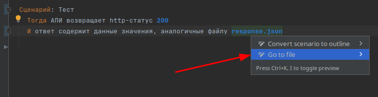
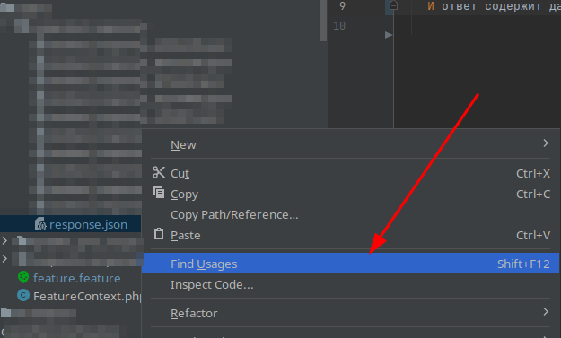
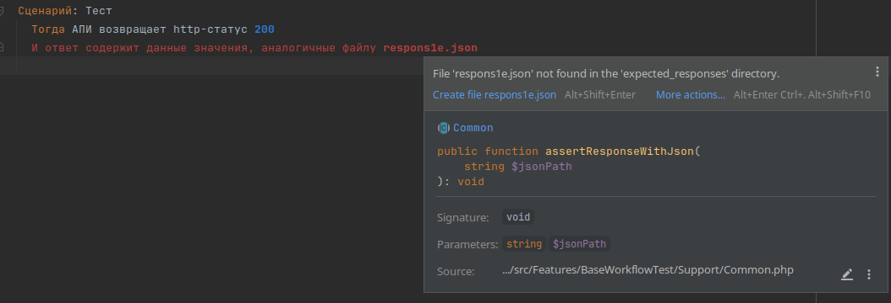
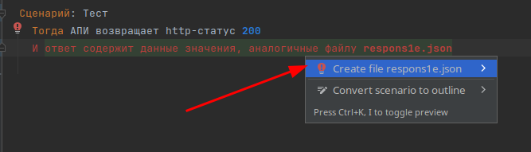

# Behat external file handling enhancements

<!-- Plugin description -->

Features:  
- [x] Support line "ответ содержит данные значения, аналогичные файлу (.+)"
- [x] Support folder "expected_responses"
- [x] Change filename in gherkin step when file renamed
- [x] Check that file exists or show quick fix "create file $filename"
- [x] Go to file context action
- [x] Find usages on file

### TODO:
- [ ] Add support for safe delete
- [ ] Add support for any folder
- [ ] Add setting with custom steps regexes

### Screens

#### Go to file

#### Find usages

#### File not found inspections

#### Create file refactoring

<!-- Plugin description end -->