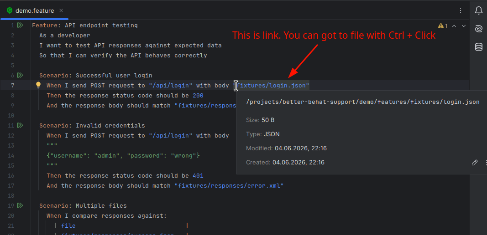
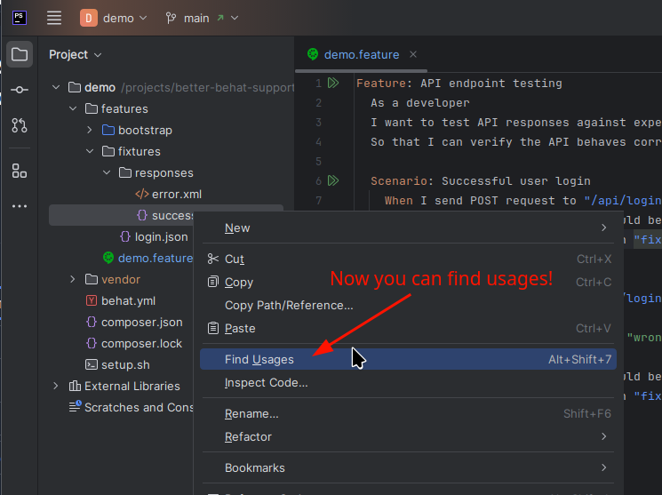
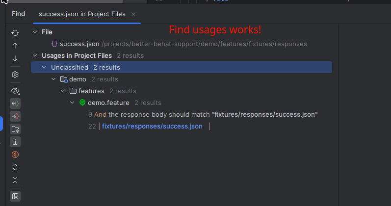
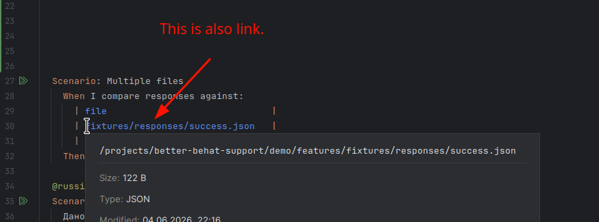

<!-- Plugin description -->

# Behat Go To File

[](https://github.com/yakov255/better-behat-support/actions)

## Problem

Your `.feature` files reference external files like `response.json` or `fixtures/request.xml`. But in the IDE these are just strings — no Ctrl+Click, no Find Usages, and renaming a file means fixing every step by hand.

## Solution

The plugin turns every file reference in Gherkin steps into a real PSI link. No configuration needed.

```
features/
├── login.feature
├── login.json
├── signup.feature
├── signup/
│   ├── request.json
│   └── response.xml
└── profile.feature
```

**Ctrl+Click** on `login.json` in a step — opens the file. **Find Usages** on `response.xml` — shows every step that mentions it. **Rename** the file — the step text updates automatically.

## Screenshots

Ctrl+click a filename in any Gherkin step to jump to the file:



Find all steps that reference a given file:





Filenames inside tables are supported too:



## How it works

The plugin scans each Gherkin step for tokens that look like filenames (anything with a dot and at least a 2-character extension). For each match it tries to resolve the file:

1. First, as a direct relative path from the `.feature` file's directory.
2. If that fails, by searching the directory and its immediate subdirectories.

Only files within the `.feature` file's content scope are considered -- vendor directories and generated code are excluded.

## Installation

**First install:** download the ZIP from [Releases](https://github.com/yakov255/better-behat-support/releases) and install it via `Settings > Plugins > Gear icon > Install Plugin from Disk`.

**Updates:** after the first install, the plugin checks for updates automatically through its custom repository. No manual steps needed.

## Requirements

- PhpStorm 2024.3 or later
- The bundled Gherkin/Cucumber plugin must be enabled (it is by default)

## Development

See [development.md](development.md) for build instructions, project structure, and release process.

<!-- Plugin description end -->
